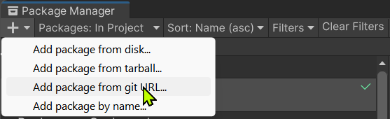

# Enum Extensions

An automated solution to provide extension methods for enums, powered by [Source Generators](https://docs.microsoft.com/en-us/dotnet/csharp/roslyn-sdk/source-generators-overview).

## Installation

### Requirements

- Unity 2022.3 or later

### Unity Package Manager

1. Open menu `Window` -> `Package Manager`.
2. Click the `+` button at the top-left corner, then choose `Add package from git URL...`.



3. Enter the package URL `https://github.com/Zitga-Tech/ZBase.Foundation.EnumExtensions/tree/main/Packages/ZBase.Foundation.EnumExtensions`.


### OpenUPM

1. Install [OpenUPM CLI](https://openupm.com/docs/getting-started.html#installing-openupm-cli).
2. Run the following command in your Unity project root directory:

```sh
openupm add com.zbase.foundation.enum-extensions
```

## How To Use

1. If you're not using any `.asmdef` in your project, continue at step 3.
2. If your project is structured with `.asmdef`, then you need to add a reference to `ZBase.Foundation.EnumExtensions.asmdef`.
3. The usage is very simple: just add this attribute `[EnumExtensions]` on the enum that needs extension methods.

```cs
[EnumExtensions]
public enum FruitType
{
    None,
    Apple,
    Banana,
    Coconut,
}

// Below are code generated automatically by a source generator
// ===

// public partial interface IFruitTypeExtensions { ... }

// public readonly partial struct FruitTypeExtensionsWrapper : IFruitTypeExtensions { ... }

// public static partial class FruitTypeExtensions { ... }

```

## Generated APIs

| API | Member Type | Description |
| --- | ----------- | ----------- |
| `Length` | Constant | The number of defined values of the enum |
| `ToStringFast` | Method | Returns the string representation of the enum value. No allocation. |
| `ToDisplayStringFast` | Method | Returns the string representation of the enum value. If the attribute is decorated with a `[Display]` attribute, then uses the provided value. Otherwise uses the name of the member, equivalent to calling `ToStringFast`. |
| `AsExtensionsWrapper` | Method | Returns the extensions wrapper for the enum value. |
| `ToUnderlyingValue` | Method | Returns the underlying numeric value of the enum value. |
| `TryParse` | Method | Converts the string representation of the name or numeric value of an enum value to the equivalent instance. |
| `TryFormat` | Method | Converts the enum value to a `Span<char>`. |
| `IsDefined` | Method | Returns a boolean telling whether the given enum value exists in the enumeration. |
| `IsDefinedIn` | Method | Returns a boolean telling whether an enum with the given name exists in the enumeration. |
| `FindIndex` | Method | Finds the index for a given enum value in the enumeration. Returns the zero-based index if the enum value exists in the enumeration, otherwise -1. |
